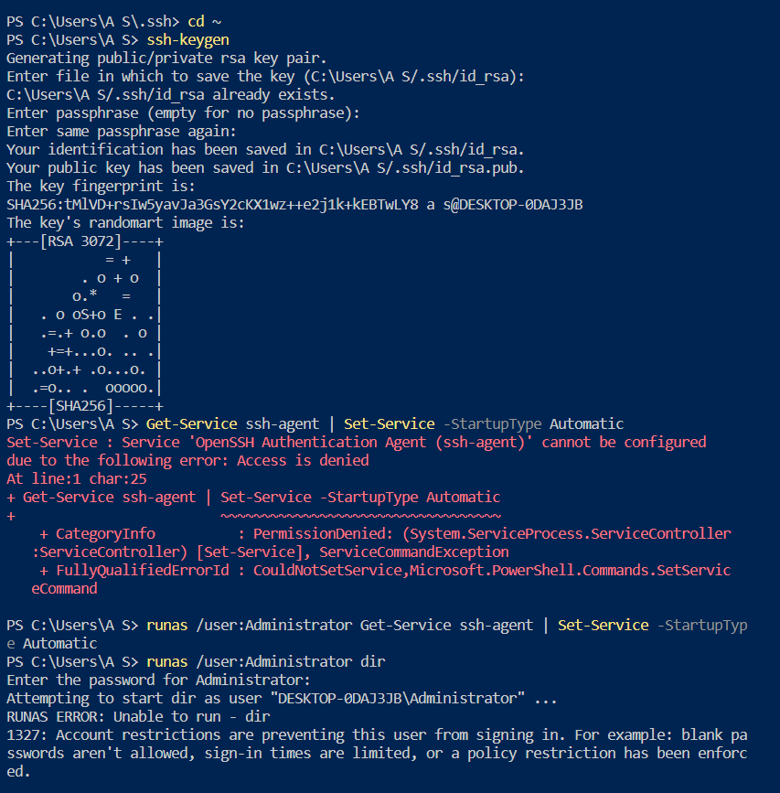
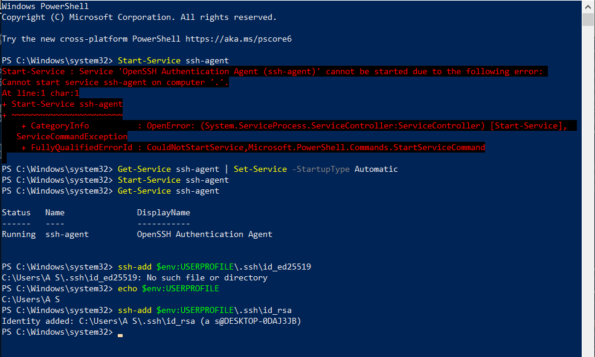
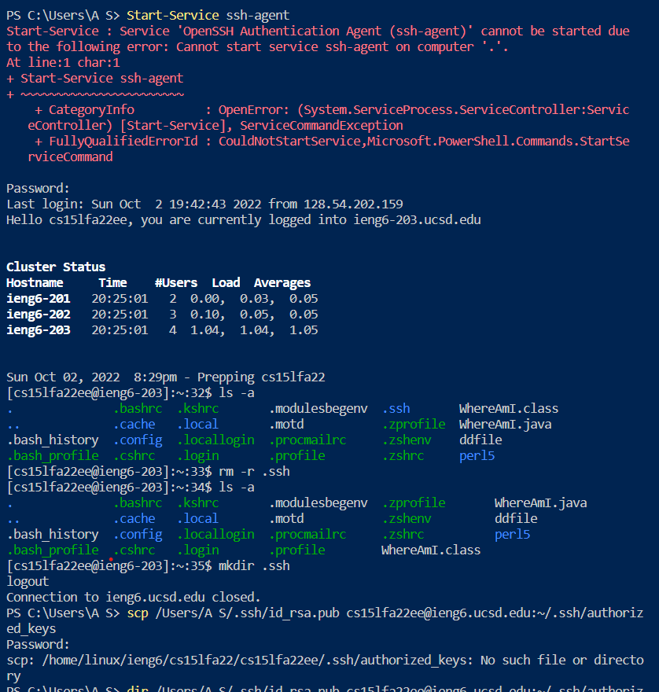
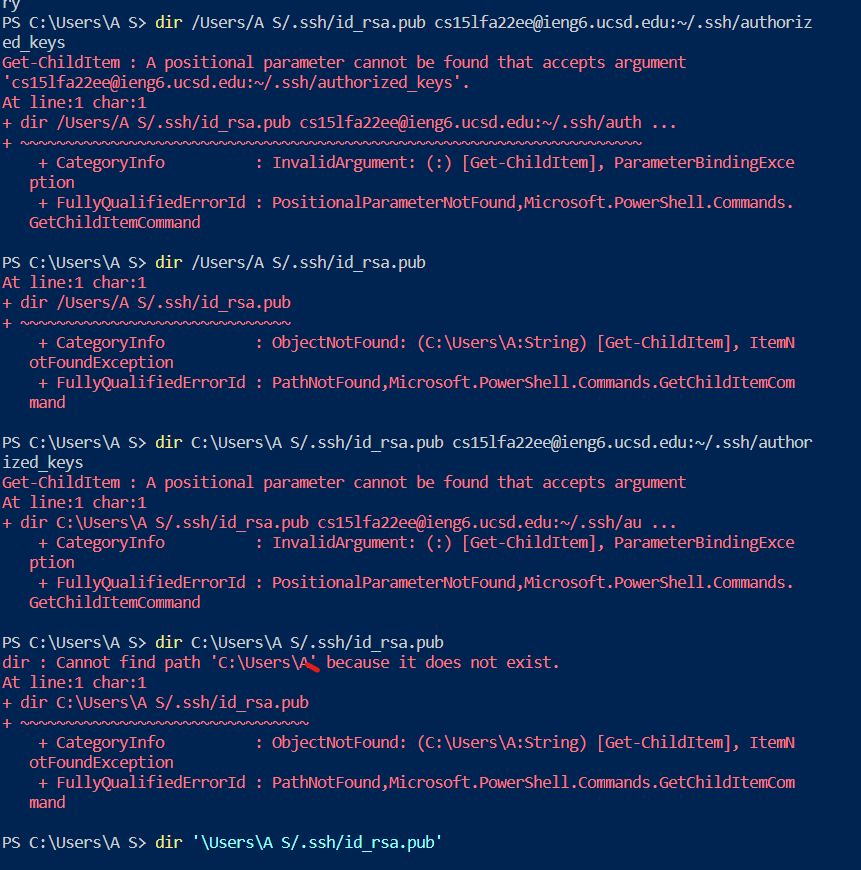

Hello future student!
This is a guide that will hopefully help you through the basics of logging into and using an ieng6 account.

Part 1: VS Code Installation

This is the simplest part. All I did was click on the link and hit the download button, and then set my theme (to Tomorrow Night Blue).

Part 2.
The second part seems incredibly simple, but it took me forever. The main problem here is that your password needs to be reset before each session, which is a tedious task. Then, you either have to perfectly type your password with no visual feedback (the password prompt response is invisible), or copy your password from another text editor.

However, even if you reset your password, logging in doesn't always work. I tried so many times to log in with my account after resetting during class, and eventually I had to switch to a TA account, and eventually that worked -- once. I finally managed to log in reliably only after many more attempts at home.

Part 3.
The next step was to try some commands. I opened 2 teminal windows: one powershell and one ssh window. I tried several commands in both - the powershell (local) commands were errors, and the ssh commands succeeded.

)

Part 4:
This part wasn't too difficult either, and I figured out how to change which folder to send the file to (by further specifying the path after ~/). I also figured out how to rename the file while moving it (after the last directory, add the name after the slash). The only special thing that needs to be done is to remember to put the path name in single quotes if your username has a space in it -- otherwise, the directions work nicely.

Part 5:
This part was very interesting: initially I was told that I had already created the .ssh directory, and then the final command failed because I messed something up in the path name (unfortunately I have no screenshot). But after that, I followed the steps more closely while at the same time avoiding blindly copying them.

.png)

After this step, the most irritating part of using the remote shell and remote copy is removed altogether, saving tons of time, password changes, and irritation.

Part 6.
The best method I found utilized lots of reusing previous commands (that have been typed before, using uparrow then enter for 2 keystrokes to repeat the previous command, or the ! followed by 1 character shortcut and enter for 3 keystrokes otherwise).

My commands can be seen in these 2 images, as well as the process I took to refine them.

In the end, my final optimization used 5 keystrokes (after I ran the two commands in the reverse order of what I would need): an uparrow and then an enter press for the first command to move WhereAmI to the server, and then 2 uparrows and an enter for the second command to launch the shell, compile, run, and exit.

I hope this walkthrough