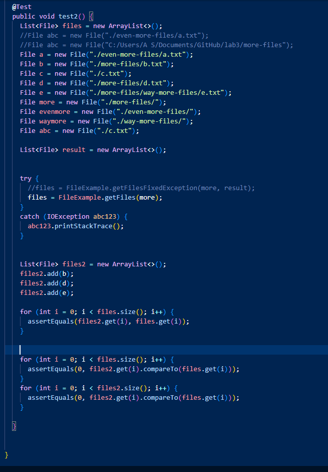

Hello future student!

This post will show what I did for my search engine and testing.

Part 1:

`
import java.io.IOException;
import java.net.URI;
import java.io.*; 
import java.util.*; 

class Handler implements URLHandler {
    // The one bit of state on the server: a number that will be manipulated by
    // various requests.
    int num = 0;

    ArrayList<String> strArray = new ArrayList<String>();

    public String handleRequest(URI url) {
        if (url.getPath().equals("/add")) {
            //System.out.println("Path: " + url.getPath());
            //System.out.println("Adding");
            String[] parameters = url.getQuery().split("=");
            strArray.add(parameters[1]);
            /*for (int i = 0; i < parameters.length; i++) {
                //System.out.println(parameters[i]);
            }*/
            return "String " + parameters[1] + " added to list";
        }
        else if (url.getPath().equals("/search")) {
            //System.out.println("Path: " + url.getPath());
            String[] parameters = url.getQuery().split("=");
            String returnValues = "Strings in the list that contain " + parameters[1] + ":";
            for (int i = 0; i < strArray.size(); i++) {
                System.out.println("i equals: " + i);
                if (strArray.get(i).contains(parameters[1])) {
                    returnValues = returnValues.concat("\n" + strArray.get(i));
                    //System.out.println("Concatenating " + strArray.get(i));
                    //System.out.println("Return Values: " + returnValues);
                }
            }
            return returnValues;
        }
        else {
            return "404 Not Found!";
        }
    }
}

class SearchEngine {
    public static void main(String[] args) throws IOException {
        if(args.length == 0){
            System.out.println("Missing port number! Try any number between 1024 to 49151");
            return;
        }

        int port = Integer.parseInt(args[0]);

        Server.start(port, new Handler());
    }
}
`

These 5 add queries use this add code (not a method, but an if branch off of the general handler method):

Each has 2 arguments passed to it: a garbage argument ("s" or something like that, I forgot), and then a relevant one. This argument is "apple", "pineapple", "nap", "app", and "potato", respectively. The arguments are separated from their raw form using split(), and stored in the array "parameters". 

parameters[1], the important argument is added to the strArray (the place where all the values that have been added are stored), and then is printed (for debug) and returned so it can be displayed on screen.

Meanwhile, the searches:

Use this search code:

Just like with adding, the search term is found by using split (the arguments are stored in the parameters array; they are s, and then app/a for the first and second, respectively), and is at index 1 in parameters. The contains string method is used to get all of the strArray contents that contain the search parameter. The returnValue has all of these concatenated to it (along with a newline).

Part 2:

For my tests, I fixed the Array and File Examples' methods, ReverseInPlace and getFiles.

ReverseInPlace:

Symptom (and Bug):

This code is broken because it doesn't actually swap anything. All it does it just set the index at i to its "opposite" in the array. To make things worse, since it iterates through the entire array, it actually changes each element in the second half to itself (since their values were copied to the elements in the first half).

This test causes a failure.

The test fails like as shown here -- the arrayList output is not equal to the swapped arrayList.

To fix this code, all I had to do was implement a simple switching algorithm, as well as integer-divide by 2 to only iterate through the first half of the list (to prevent switching back). 

GetFiles:

This test causes a failure with the original code. It's a little long because of redundancy (I spent 4 hours trying to figure out why it wasn't working only to realize I forgot to add @Test to my second test, and what I was actually testing was an empty test. After that I only needed 5 minutes).

Here is the failure message for FileTests -- the more-files directory is mistakenly added to the output (and all of the files more than a layer deep aren't there, but you can't see that).

And here is the fixed implementation. The only fixes necessary were directory checking (to not add directories to the list) and recurive ability to search within any directories that were found.

The bugs (adding files, lack of search depth) were obviously at fault for the mistaken addition of the more-files directory to the "results" return list. Not shown is the failure to add files that are deeper into the directory structure, such as e.txt.

Hope this helped enough!

